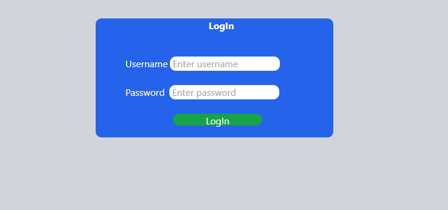
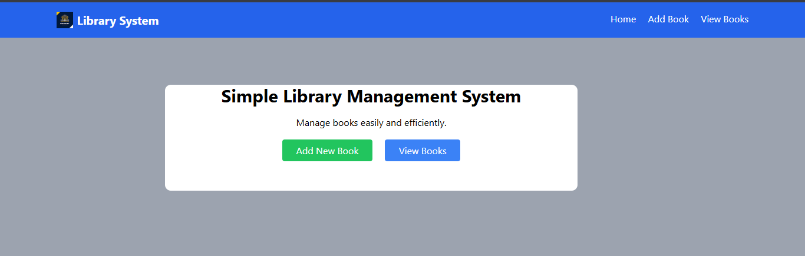
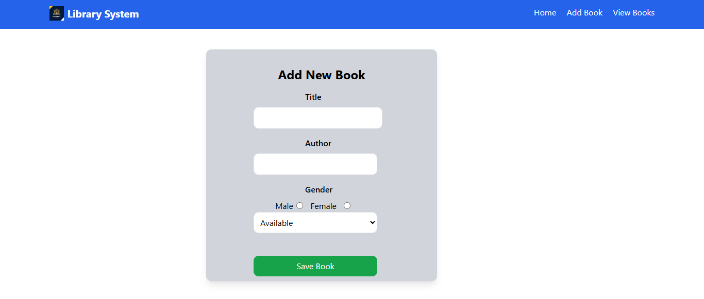
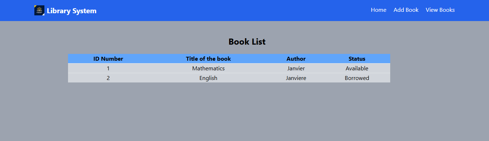

 Simple Library Management System

 Project Description
The Simple Library Management System is a basic web application developed for accessing the library easily.

This version is frontend-only and demonstrates page navigation, form design, and user interface layout using HTML and Tailwind CSS.

 -Technologies Used

HTML5
Tailwind CSS (CDN)

-Pages Included

Home Page
Project introduction
Navigation menu
Buttons linking to Add Book and View Books pages

 -Add Book Page
Form to enter:
Book Title
Author
Status (Available / Borrowed)
Save button

 -View Books Page
 Displays sample book records in a table

This project demonstrates fundamental web development skills including:

Page linking
Form creation 
Table layout
Basic UI design principles

##screenshots

